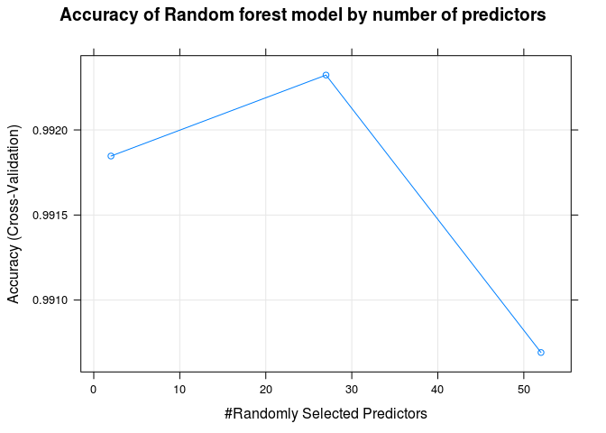
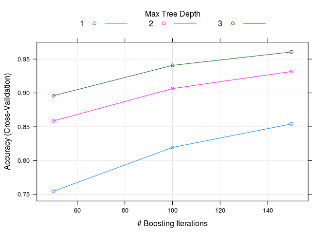

Analysis of PUC-Rio motion Data
================
Eduardo Pacheco
4 de setembro de 2018

Intro
=====

This is my submission to Practical Machine Learning course, part of Data Science Specialization

1. Background
=============

Using devices such as Jawbone Up, Nike FuelBand, and Fitbit it is now possible to collect a large amount of data about personal activity relatively inexpensively. These type of devices are part of the quantified self movement – a group of enthusiasts who take measurements about themselves regularly to improve their health, to find patterns in their behavior, or because they are tech geeks. One thing that people regularly do is quantify how much of a particular activity they do, but they rarely quantify how well they do it. In this project, your goal will be to use data from accelerometers on the belt, forearm, arm, and dumbell of 6 participants. They were asked to perform barbell lifts correctly and incorrectly in 5 different ways. More information is available from the website here: <http://web.archive.org/web/20161224072740/http:/groupware.les.inf.puc-rio.br/har> (see the section on the Weight Lifting Exercise Dataset).

2 Data
======

The training data for this project are available here:

<https://d396qusza40orc.cloudfront.net/predmachlearn/pml-training.csv>

The test data are available here:

<https://d396qusza40orc.cloudfront.net/predmachlearn/pml-testing.csv>

The data for this project come from this source: <http://web.archive.org/web/20161224072740/http:/groupware.les.inf.puc-rio.br/har>. If you use the document you create for this class for any purpose please cite them as they have been very generous in allowing their data to be used for this kind of assignment.

3. Loading libraries
====================

We will use caret and rattle packages.

``` r
library('caret')
```

    ## Loading required package: lattice

    ## Loading required package: ggplot2

``` r
library('rattle')
```

    ## Rattle: A free graphical interface for data science with R.
    ## Version 5.2.0 Copyright (c) 2006-2018 Togaware Pty Ltd.
    ## Type 'rattle()' to shake, rattle, and roll your data.

4. Downloading and Loading Data
===============================

I prefer to download the data via R code so lets do it. Then, we get the content of csv file and add to data frame.

``` r
trainset.url <- 'https://d396qusza40orc.cloudfront.net/predmachlearn/pml-training.csv'

testset.url <- 'https://d396qusza40orc.cloudfront.net/predmachlearn/pml-testing.csv'

download.file(trainset.url, method='auto', destfile='train.csv')
download.file(testset.url, method='auto', destfile='test.csv')

train.df <- read.csv('train.csv')
test.df <- read.csv('test.csv')
```

Now we need to do some basic exploratory data analysis

``` r
str(train.df)
```

    ## 'data.frame':    19622 obs. of  160 variables:
    ##  $ X                       : int  1 2 3 4 5 6 7 8 9 10 ...
    ##  $ user_name               : Factor w/ 6 levels "adelmo","carlitos",..: 2 2 2 2 2 2 2 2 2 2 ...
    ##  $ raw_timestamp_part_1    : int  1323084231 1323084231 1323084231 1323084232 1323084232 1323084232 1323084232 1323084232 1323084232 1323084232 ...
    ##  $ raw_timestamp_part_2    : int  788290 808298 820366 120339 196328 304277 368296 440390 484323 484434 ...
    ##  $ cvtd_timestamp          : Factor w/ 20 levels "02/12/2011 13:32",..: 9 9 9 9 9 9 9 9 9 9 ...
    ##  $ new_window              : Factor w/ 2 levels "no","yes": 1 1 1 1 1 1 1 1 1 1 ...
    ##  $ num_window              : int  11 11 11 12 12 12 12 12 12 12 ...
    ##  $ roll_belt               : num  1.41 1.41 1.42 1.48 1.48 1.45 1.42 1.42 1.43 1.45 ...
    ##  $ pitch_belt              : num  8.07 8.07 8.07 8.05 8.07 8.06 8.09 8.13 8.16 8.17 ...
    ##  $ yaw_belt                : num  -94.4 -94.4 -94.4 -94.4 -94.4 -94.4 -94.4 -94.4 -94.4 -94.4 ...
    ##  $ total_accel_belt        : int  3 3 3 3 3 3 3 3 3 3 ...
    ##  $ kurtosis_roll_belt      : Factor w/ 397 levels "","0.000673",..: 1 1 1 1 1 1 1 1 1 1 ...
    ##  $ kurtosis_picth_belt     : Factor w/ 317 levels "","0.006078",..: 1 1 1 1 1 1 1 1 1 1 ...
    ##  $ kurtosis_yaw_belt       : Factor w/ 2 levels "","#DIV/0!": 1 1 1 1 1 1 1 1 1 1 ...
    ##  $ skewness_roll_belt      : Factor w/ 395 levels "","0.000000",..: 1 1 1 1 1 1 1 1 1 1 ...
    ##  $ skewness_roll_belt.1    : Factor w/ 338 levels "","0.000000",..: 1 1 1 1 1 1 1 1 1 1 ...
    ##  $ skewness_yaw_belt       : Factor w/ 2 levels "","#DIV/0!": 1 1 1 1 1 1 1 1 1 1 ...
    ##  $ max_roll_belt           : num  NA NA NA NA NA NA NA NA NA NA ...
    ##  $ max_picth_belt          : int  NA NA NA NA NA NA NA NA NA NA ...
    ##  $ max_yaw_belt            : Factor w/ 68 levels "","0.0","-0.1",..: 1 1 1 1 1 1 1 1 1 1 ...
    ##  $ min_roll_belt           : num  NA NA NA NA NA NA NA NA NA NA ...
    ##  $ min_pitch_belt          : int  NA NA NA NA NA NA NA NA NA NA ...
    ##  $ min_yaw_belt            : Factor w/ 68 levels "","0.0","-0.1",..: 1 1 1 1 1 1 1 1 1 1 ...
    ##  $ amplitude_roll_belt     : num  NA NA NA NA NA NA NA NA NA NA ...
    ##  $ amplitude_pitch_belt    : int  NA NA NA NA NA NA NA NA NA NA ...
    ##  $ amplitude_yaw_belt      : Factor w/ 4 levels "","0.00","0.0000",..: 1 1 1 1 1 1 1 1 1 1 ...
    ##  $ var_total_accel_belt    : num  NA NA NA NA NA NA NA NA NA NA ...
    ##  $ avg_roll_belt           : num  NA NA NA NA NA NA NA NA NA NA ...
    ##  $ stddev_roll_belt        : num  NA NA NA NA NA NA NA NA NA NA ...
    ##  $ var_roll_belt           : num  NA NA NA NA NA NA NA NA NA NA ...
    ##  $ avg_pitch_belt          : num  NA NA NA NA NA NA NA NA NA NA ...
    ##  $ stddev_pitch_belt       : num  NA NA NA NA NA NA NA NA NA NA ...
    ##  $ var_pitch_belt          : num  NA NA NA NA NA NA NA NA NA NA ...
    ##  $ avg_yaw_belt            : num  NA NA NA NA NA NA NA NA NA NA ...
    ##  $ stddev_yaw_belt         : num  NA NA NA NA NA NA NA NA NA NA ...
    ##  $ var_yaw_belt            : num  NA NA NA NA NA NA NA NA NA NA ...
    ##  $ gyros_belt_x            : num  0 0.02 0 0.02 0.02 0.02 0.02 0.02 0.02 0.03 ...
    ##  $ gyros_belt_y            : num  0 0 0 0 0.02 0 0 0 0 0 ...
    ##  $ gyros_belt_z            : num  -0.02 -0.02 -0.02 -0.03 -0.02 -0.02 -0.02 -0.02 -0.02 0 ...
    ##  $ accel_belt_x            : int  -21 -22 -20 -22 -21 -21 -22 -22 -20 -21 ...
    ##  $ accel_belt_y            : int  4 4 5 3 2 4 3 4 2 4 ...
    ##  $ accel_belt_z            : int  22 22 23 21 24 21 21 21 24 22 ...
    ##  $ magnet_belt_x           : int  -3 -7 -2 -6 -6 0 -4 -2 1 -3 ...
    ##  $ magnet_belt_y           : int  599 608 600 604 600 603 599 603 602 609 ...
    ##  $ magnet_belt_z           : int  -313 -311 -305 -310 -302 -312 -311 -313 -312 -308 ...
    ##  $ roll_arm                : num  -128 -128 -128 -128 -128 -128 -128 -128 -128 -128 ...
    ##  $ pitch_arm               : num  22.5 22.5 22.5 22.1 22.1 22 21.9 21.8 21.7 21.6 ...
    ##  $ yaw_arm                 : num  -161 -161 -161 -161 -161 -161 -161 -161 -161 -161 ...
    ##  $ total_accel_arm         : int  34 34 34 34 34 34 34 34 34 34 ...
    ##  $ var_accel_arm           : num  NA NA NA NA NA NA NA NA NA NA ...
    ##  $ avg_roll_arm            : num  NA NA NA NA NA NA NA NA NA NA ...
    ##  $ stddev_roll_arm         : num  NA NA NA NA NA NA NA NA NA NA ...
    ##  $ var_roll_arm            : num  NA NA NA NA NA NA NA NA NA NA ...
    ##  $ avg_pitch_arm           : num  NA NA NA NA NA NA NA NA NA NA ...
    ##  $ stddev_pitch_arm        : num  NA NA NA NA NA NA NA NA NA NA ...
    ##  $ var_pitch_arm           : num  NA NA NA NA NA NA NA NA NA NA ...
    ##  $ avg_yaw_arm             : num  NA NA NA NA NA NA NA NA NA NA ...
    ##  $ stddev_yaw_arm          : num  NA NA NA NA NA NA NA NA NA NA ...
    ##  $ var_yaw_arm             : num  NA NA NA NA NA NA NA NA NA NA ...
    ##  $ gyros_arm_x             : num  0 0.02 0.02 0.02 0 0.02 0 0.02 0.02 0.02 ...
    ##  $ gyros_arm_y             : num  0 -0.02 -0.02 -0.03 -0.03 -0.03 -0.03 -0.02 -0.03 -0.03 ...
    ##  $ gyros_arm_z             : num  -0.02 -0.02 -0.02 0.02 0 0 0 0 -0.02 -0.02 ...
    ##  $ accel_arm_x             : int  -288 -290 -289 -289 -289 -289 -289 -289 -288 -288 ...
    ##  $ accel_arm_y             : int  109 110 110 111 111 111 111 111 109 110 ...
    ##  $ accel_arm_z             : int  -123 -125 -126 -123 -123 -122 -125 -124 -122 -124 ...
    ##  $ magnet_arm_x            : int  -368 -369 -368 -372 -374 -369 -373 -372 -369 -376 ...
    ##  $ magnet_arm_y            : int  337 337 344 344 337 342 336 338 341 334 ...
    ##  $ magnet_arm_z            : int  516 513 513 512 506 513 509 510 518 516 ...
    ##  $ kurtosis_roll_arm       : Factor w/ 330 levels "","0.01388","0.01574",..: 1 1 1 1 1 1 1 1 1 1 ...
    ##  $ kurtosis_picth_arm      : Factor w/ 328 levels "","-0.00484",..: 1 1 1 1 1 1 1 1 1 1 ...
    ##  $ kurtosis_yaw_arm        : Factor w/ 395 levels "","-0.01548",..: 1 1 1 1 1 1 1 1 1 1 ...
    ##  $ skewness_roll_arm       : Factor w/ 331 levels "","-0.00051",..: 1 1 1 1 1 1 1 1 1 1 ...
    ##  $ skewness_pitch_arm      : Factor w/ 328 levels "","0.00000","-0.00184",..: 1 1 1 1 1 1 1 1 1 1 ...
    ##  $ skewness_yaw_arm        : Factor w/ 395 levels "","0.00000","-0.00311",..: 1 1 1 1 1 1 1 1 1 1 ...
    ##  $ max_roll_arm            : num  NA NA NA NA NA NA NA NA NA NA ...
    ##  $ max_picth_arm           : num  NA NA NA NA NA NA NA NA NA NA ...
    ##  $ max_yaw_arm             : int  NA NA NA NA NA NA NA NA NA NA ...
    ##  $ min_roll_arm            : num  NA NA NA NA NA NA NA NA NA NA ...
    ##  $ min_pitch_arm           : num  NA NA NA NA NA NA NA NA NA NA ...
    ##  $ min_yaw_arm             : int  NA NA NA NA NA NA NA NA NA NA ...
    ##  $ amplitude_roll_arm      : num  NA NA NA NA NA NA NA NA NA NA ...
    ##  $ amplitude_pitch_arm     : num  NA NA NA NA NA NA NA NA NA NA ...
    ##  $ amplitude_yaw_arm       : int  NA NA NA NA NA NA NA NA NA NA ...
    ##  $ roll_dumbbell           : num  13.1 13.1 12.9 13.4 13.4 ...
    ##  $ pitch_dumbbell          : num  -70.5 -70.6 -70.3 -70.4 -70.4 ...
    ##  $ yaw_dumbbell            : num  -84.9 -84.7 -85.1 -84.9 -84.9 ...
    ##  $ kurtosis_roll_dumbbell  : Factor w/ 398 levels "","0.0016","-0.0035",..: 1 1 1 1 1 1 1 1 1 1 ...
    ##  $ kurtosis_picth_dumbbell : Factor w/ 401 levels "","0.0045","0.0130",..: 1 1 1 1 1 1 1 1 1 1 ...
    ##  $ kurtosis_yaw_dumbbell   : Factor w/ 2 levels "","#DIV/0!": 1 1 1 1 1 1 1 1 1 1 ...
    ##  $ skewness_roll_dumbbell  : Factor w/ 401 levels "","0.0011","0.0014",..: 1 1 1 1 1 1 1 1 1 1 ...
    ##  $ skewness_pitch_dumbbell : Factor w/ 402 levels "","-0.0053","0.0063",..: 1 1 1 1 1 1 1 1 1 1 ...
    ##  $ skewness_yaw_dumbbell   : Factor w/ 2 levels "","#DIV/0!": 1 1 1 1 1 1 1 1 1 1 ...
    ##  $ max_roll_dumbbell       : num  NA NA NA NA NA NA NA NA NA NA ...
    ##  $ max_picth_dumbbell      : num  NA NA NA NA NA NA NA NA NA NA ...
    ##  $ max_yaw_dumbbell        : Factor w/ 73 levels "","0.0","-0.1",..: 1 1 1 1 1 1 1 1 1 1 ...
    ##  $ min_roll_dumbbell       : num  NA NA NA NA NA NA NA NA NA NA ...
    ##  $ min_pitch_dumbbell      : num  NA NA NA NA NA NA NA NA NA NA ...
    ##  $ min_yaw_dumbbell        : Factor w/ 73 levels "","0.0","-0.1",..: 1 1 1 1 1 1 1 1 1 1 ...
    ##  $ amplitude_roll_dumbbell : num  NA NA NA NA NA NA NA NA NA NA ...
    ##   [list output truncated]

``` r
head(train.df)
```

    ##   X user_name raw_timestamp_part_1 raw_timestamp_part_2   cvtd_timestamp
    ## 1 1  carlitos           1323084231               788290 05/12/2011 11:23
    ## 2 2  carlitos           1323084231               808298 05/12/2011 11:23
    ## 3 3  carlitos           1323084231               820366 05/12/2011 11:23
    ## 4 4  carlitos           1323084232               120339 05/12/2011 11:23
    ## 5 5  carlitos           1323084232               196328 05/12/2011 11:23
    ## 6 6  carlitos           1323084232               304277 05/12/2011 11:23
    ##   new_window num_window roll_belt pitch_belt yaw_belt total_accel_belt
    ## 1         no         11      1.41       8.07    -94.4                3
    ## 2         no         11      1.41       8.07    -94.4                3
    ## 3         no         11      1.42       8.07    -94.4                3
    ## 4         no         12      1.48       8.05    -94.4                3
    ## 5         no         12      1.48       8.07    -94.4                3
    ## 6         no         12      1.45       8.06    -94.4                3
    ##   kurtosis_roll_belt kurtosis_picth_belt kurtosis_yaw_belt
    ## 1                                                         
    ## 2                                                         
    ## 3                                                         
    ## 4                                                         
    ## 5                                                         
    ## 6                                                         
    ##   skewness_roll_belt skewness_roll_belt.1 skewness_yaw_belt max_roll_belt
    ## 1                                                                      NA
    ## 2                                                                      NA
    ## 3                                                                      NA
    ## 4                                                                      NA
    ## 5                                                                      NA
    ## 6                                                                      NA
    ##   max_picth_belt max_yaw_belt min_roll_belt min_pitch_belt min_yaw_belt
    ## 1             NA                         NA             NA             
    ## 2             NA                         NA             NA             
    ## 3             NA                         NA             NA             
    ## 4             NA                         NA             NA             
    ## 5             NA                         NA             NA             
    ## 6             NA                         NA             NA             
    ##   amplitude_roll_belt amplitude_pitch_belt amplitude_yaw_belt
    ## 1                  NA                   NA                   
    ## 2                  NA                   NA                   
    ## 3                  NA                   NA                   
    ## 4                  NA                   NA                   
    ## 5                  NA                   NA                   
    ## 6                  NA                   NA                   
    ##   var_total_accel_belt avg_roll_belt stddev_roll_belt var_roll_belt
    ## 1                   NA            NA               NA            NA
    ## 2                   NA            NA               NA            NA
    ## 3                   NA            NA               NA            NA
    ## 4                   NA            NA               NA            NA
    ## 5                   NA            NA               NA            NA
    ## 6                   NA            NA               NA            NA
    ##   avg_pitch_belt stddev_pitch_belt var_pitch_belt avg_yaw_belt
    ## 1             NA                NA             NA           NA
    ## 2             NA                NA             NA           NA
    ## 3             NA                NA             NA           NA
    ## 4             NA                NA             NA           NA
    ## 5             NA                NA             NA           NA
    ## 6             NA                NA             NA           NA
    ##   stddev_yaw_belt var_yaw_belt gyros_belt_x gyros_belt_y gyros_belt_z
    ## 1              NA           NA         0.00         0.00        -0.02
    ## 2              NA           NA         0.02         0.00        -0.02
    ## 3              NA           NA         0.00         0.00        -0.02
    ## 4              NA           NA         0.02         0.00        -0.03
    ## 5              NA           NA         0.02         0.02        -0.02
    ## 6              NA           NA         0.02         0.00        -0.02
    ##   accel_belt_x accel_belt_y accel_belt_z magnet_belt_x magnet_belt_y
    ## 1          -21            4           22            -3           599
    ## 2          -22            4           22            -7           608
    ## 3          -20            5           23            -2           600
    ## 4          -22            3           21            -6           604
    ## 5          -21            2           24            -6           600
    ## 6          -21            4           21             0           603
    ##   magnet_belt_z roll_arm pitch_arm yaw_arm total_accel_arm var_accel_arm
    ## 1          -313     -128      22.5    -161              34            NA
    ## 2          -311     -128      22.5    -161              34            NA
    ## 3          -305     -128      22.5    -161              34            NA
    ## 4          -310     -128      22.1    -161              34            NA
    ## 5          -302     -128      22.1    -161              34            NA
    ## 6          -312     -128      22.0    -161              34            NA
    ##   avg_roll_arm stddev_roll_arm var_roll_arm avg_pitch_arm stddev_pitch_arm
    ## 1           NA              NA           NA            NA               NA
    ## 2           NA              NA           NA            NA               NA
    ## 3           NA              NA           NA            NA               NA
    ## 4           NA              NA           NA            NA               NA
    ## 5           NA              NA           NA            NA               NA
    ## 6           NA              NA           NA            NA               NA
    ##   var_pitch_arm avg_yaw_arm stddev_yaw_arm var_yaw_arm gyros_arm_x
    ## 1            NA          NA             NA          NA        0.00
    ## 2            NA          NA             NA          NA        0.02
    ## 3            NA          NA             NA          NA        0.02
    ## 4            NA          NA             NA          NA        0.02
    ## 5            NA          NA             NA          NA        0.00
    ## 6            NA          NA             NA          NA        0.02
    ##   gyros_arm_y gyros_arm_z accel_arm_x accel_arm_y accel_arm_z magnet_arm_x
    ## 1        0.00       -0.02        -288         109        -123         -368
    ## 2       -0.02       -0.02        -290         110        -125         -369
    ## 3       -0.02       -0.02        -289         110        -126         -368
    ## 4       -0.03        0.02        -289         111        -123         -372
    ## 5       -0.03        0.00        -289         111        -123         -374
    ## 6       -0.03        0.00        -289         111        -122         -369
    ##   magnet_arm_y magnet_arm_z kurtosis_roll_arm kurtosis_picth_arm
    ## 1          337          516                                     
    ## 2          337          513                                     
    ## 3          344          513                                     
    ## 4          344          512                                     
    ## 5          337          506                                     
    ## 6          342          513                                     
    ##   kurtosis_yaw_arm skewness_roll_arm skewness_pitch_arm skewness_yaw_arm
    ## 1                                                                       
    ## 2                                                                       
    ## 3                                                                       
    ## 4                                                                       
    ## 5                                                                       
    ## 6                                                                       
    ##   max_roll_arm max_picth_arm max_yaw_arm min_roll_arm min_pitch_arm
    ## 1           NA            NA          NA           NA            NA
    ## 2           NA            NA          NA           NA            NA
    ## 3           NA            NA          NA           NA            NA
    ## 4           NA            NA          NA           NA            NA
    ## 5           NA            NA          NA           NA            NA
    ## 6           NA            NA          NA           NA            NA
    ##   min_yaw_arm amplitude_roll_arm amplitude_pitch_arm amplitude_yaw_arm
    ## 1          NA                 NA                  NA                NA
    ## 2          NA                 NA                  NA                NA
    ## 3          NA                 NA                  NA                NA
    ## 4          NA                 NA                  NA                NA
    ## 5          NA                 NA                  NA                NA
    ## 6          NA                 NA                  NA                NA
    ##   roll_dumbbell pitch_dumbbell yaw_dumbbell kurtosis_roll_dumbbell
    ## 1      13.05217      -70.49400    -84.87394                       
    ## 2      13.13074      -70.63751    -84.71065                       
    ## 3      12.85075      -70.27812    -85.14078                       
    ## 4      13.43120      -70.39379    -84.87363                       
    ## 5      13.37872      -70.42856    -84.85306                       
    ## 6      13.38246      -70.81759    -84.46500                       
    ##   kurtosis_picth_dumbbell kurtosis_yaw_dumbbell skewness_roll_dumbbell
    ## 1                                                                     
    ## 2                                                                     
    ## 3                                                                     
    ## 4                                                                     
    ## 5                                                                     
    ## 6                                                                     
    ##   skewness_pitch_dumbbell skewness_yaw_dumbbell max_roll_dumbbell
    ## 1                                                              NA
    ## 2                                                              NA
    ## 3                                                              NA
    ## 4                                                              NA
    ## 5                                                              NA
    ## 6                                                              NA
    ##   max_picth_dumbbell max_yaw_dumbbell min_roll_dumbbell min_pitch_dumbbell
    ## 1                 NA                                 NA                 NA
    ## 2                 NA                                 NA                 NA
    ## 3                 NA                                 NA                 NA
    ## 4                 NA                                 NA                 NA
    ## 5                 NA                                 NA                 NA
    ## 6                 NA                                 NA                 NA
    ##   min_yaw_dumbbell amplitude_roll_dumbbell amplitude_pitch_dumbbell
    ## 1                                       NA                       NA
    ## 2                                       NA                       NA
    ## 3                                       NA                       NA
    ## 4                                       NA                       NA
    ## 5                                       NA                       NA
    ## 6                                       NA                       NA
    ##   amplitude_yaw_dumbbell total_accel_dumbbell var_accel_dumbbell
    ## 1                                          37                 NA
    ## 2                                          37                 NA
    ## 3                                          37                 NA
    ## 4                                          37                 NA
    ## 5                                          37                 NA
    ## 6                                          37                 NA
    ##   avg_roll_dumbbell stddev_roll_dumbbell var_roll_dumbbell
    ## 1                NA                   NA                NA
    ## 2                NA                   NA                NA
    ## 3                NA                   NA                NA
    ## 4                NA                   NA                NA
    ## 5                NA                   NA                NA
    ## 6                NA                   NA                NA
    ##   avg_pitch_dumbbell stddev_pitch_dumbbell var_pitch_dumbbell
    ## 1                 NA                    NA                 NA
    ## 2                 NA                    NA                 NA
    ## 3                 NA                    NA                 NA
    ## 4                 NA                    NA                 NA
    ## 5                 NA                    NA                 NA
    ## 6                 NA                    NA                 NA
    ##   avg_yaw_dumbbell stddev_yaw_dumbbell var_yaw_dumbbell gyros_dumbbell_x
    ## 1               NA                  NA               NA                0
    ## 2               NA                  NA               NA                0
    ## 3               NA                  NA               NA                0
    ## 4               NA                  NA               NA                0
    ## 5               NA                  NA               NA                0
    ## 6               NA                  NA               NA                0
    ##   gyros_dumbbell_y gyros_dumbbell_z accel_dumbbell_x accel_dumbbell_y
    ## 1            -0.02             0.00             -234               47
    ## 2            -0.02             0.00             -233               47
    ## 3            -0.02             0.00             -232               46
    ## 4            -0.02            -0.02             -232               48
    ## 5            -0.02             0.00             -233               48
    ## 6            -0.02             0.00             -234               48
    ##   accel_dumbbell_z magnet_dumbbell_x magnet_dumbbell_y magnet_dumbbell_z
    ## 1             -271              -559               293               -65
    ## 2             -269              -555               296               -64
    ## 3             -270              -561               298               -63
    ## 4             -269              -552               303               -60
    ## 5             -270              -554               292               -68
    ## 6             -269              -558               294               -66
    ##   roll_forearm pitch_forearm yaw_forearm kurtosis_roll_forearm
    ## 1         28.4         -63.9        -153                      
    ## 2         28.3         -63.9        -153                      
    ## 3         28.3         -63.9        -152                      
    ## 4         28.1         -63.9        -152                      
    ## 5         28.0         -63.9        -152                      
    ## 6         27.9         -63.9        -152                      
    ##   kurtosis_picth_forearm kurtosis_yaw_forearm skewness_roll_forearm
    ## 1                                                                  
    ## 2                                                                  
    ## 3                                                                  
    ## 4                                                                  
    ## 5                                                                  
    ## 6                                                                  
    ##   skewness_pitch_forearm skewness_yaw_forearm max_roll_forearm
    ## 1                                                           NA
    ## 2                                                           NA
    ## 3                                                           NA
    ## 4                                                           NA
    ## 5                                                           NA
    ## 6                                                           NA
    ##   max_picth_forearm max_yaw_forearm min_roll_forearm min_pitch_forearm
    ## 1                NA                               NA                NA
    ## 2                NA                               NA                NA
    ## 3                NA                               NA                NA
    ## 4                NA                               NA                NA
    ## 5                NA                               NA                NA
    ## 6                NA                               NA                NA
    ##   min_yaw_forearm amplitude_roll_forearm amplitude_pitch_forearm
    ## 1                                     NA                      NA
    ## 2                                     NA                      NA
    ## 3                                     NA                      NA
    ## 4                                     NA                      NA
    ## 5                                     NA                      NA
    ## 6                                     NA                      NA
    ##   amplitude_yaw_forearm total_accel_forearm var_accel_forearm
    ## 1                                        36                NA
    ## 2                                        36                NA
    ## 3                                        36                NA
    ## 4                                        36                NA
    ## 5                                        36                NA
    ## 6                                        36                NA
    ##   avg_roll_forearm stddev_roll_forearm var_roll_forearm avg_pitch_forearm
    ## 1               NA                  NA               NA                NA
    ## 2               NA                  NA               NA                NA
    ## 3               NA                  NA               NA                NA
    ## 4               NA                  NA               NA                NA
    ## 5               NA                  NA               NA                NA
    ## 6               NA                  NA               NA                NA
    ##   stddev_pitch_forearm var_pitch_forearm avg_yaw_forearm
    ## 1                   NA                NA              NA
    ## 2                   NA                NA              NA
    ## 3                   NA                NA              NA
    ## 4                   NA                NA              NA
    ## 5                   NA                NA              NA
    ## 6                   NA                NA              NA
    ##   stddev_yaw_forearm var_yaw_forearm gyros_forearm_x gyros_forearm_y
    ## 1                 NA              NA            0.03            0.00
    ## 2                 NA              NA            0.02            0.00
    ## 3                 NA              NA            0.03           -0.02
    ## 4                 NA              NA            0.02           -0.02
    ## 5                 NA              NA            0.02            0.00
    ## 6                 NA              NA            0.02           -0.02
    ##   gyros_forearm_z accel_forearm_x accel_forearm_y accel_forearm_z
    ## 1           -0.02             192             203            -215
    ## 2           -0.02             192             203            -216
    ## 3            0.00             196             204            -213
    ## 4            0.00             189             206            -214
    ## 5           -0.02             189             206            -214
    ## 6           -0.03             193             203            -215
    ##   magnet_forearm_x magnet_forearm_y magnet_forearm_z classe
    ## 1              -17              654              476      A
    ## 2              -18              661              473      A
    ## 3              -18              658              469      A
    ## 4              -16              658              469      A
    ## 5              -17              655              473      A
    ## 6               -9              660              478      A

``` r
tail(train.df)
```

    ##           X user_name raw_timestamp_part_1 raw_timestamp_part_2
    ## 19617 19617    adelmo           1322832937               588324
    ## 19618 19618    adelmo           1322832937               588376
    ## 19619 19619    adelmo           1322832937               596287
    ## 19620 19620    adelmo           1322832937               636283
    ## 19621 19621    adelmo           1322832937               964299
    ## 19622 19622    adelmo           1322832937               972293
    ##         cvtd_timestamp new_window num_window roll_belt pitch_belt yaw_belt
    ## 19617 02/12/2011 13:35         no        864       148      -34.7      129
    ## 19618 02/12/2011 13:35         no        864       147      -34.8      129
    ## 19619 02/12/2011 13:35         no        864       145      -35.3      130
    ## 19620 02/12/2011 13:35         no        864       145      -35.5      130
    ## 19621 02/12/2011 13:35         no        864       143      -35.9      131
    ## 19622 02/12/2011 13:35        yes        864       143      -36.0      132
    ##       total_accel_belt kurtosis_roll_belt kurtosis_picth_belt
    ## 19617               21                                       
    ## 19618               21                                       
    ## 19619               19                                       
    ## 19620               19                                       
    ## 19621               18                                       
    ## 19622               18          -1.175902           -1.063259
    ##       kurtosis_yaw_belt skewness_roll_belt skewness_roll_belt.1
    ## 19617                                                          
    ## 19618                                                          
    ## 19619                                                          
    ## 19620                                                          
    ## 19621                                                          
    ## 19622           #DIV/0!           0.196860            -0.572396
    ##       skewness_yaw_belt max_roll_belt max_picth_belt max_yaw_belt
    ## 19617                              NA             NA             
    ## 19618                              NA             NA             
    ## 19619                              NA             NA             
    ## 19620                              NA             NA             
    ## 19621                              NA             NA             
    ## 19622           #DIV/0!           132             25         -1.2
    ##       min_roll_belt min_pitch_belt min_yaw_belt amplitude_roll_belt
    ## 19617            NA             NA                               NA
    ## 19618            NA             NA                               NA
    ## 19619            NA             NA                               NA
    ## 19620            NA             NA                               NA
    ## 19621            NA             NA                               NA
    ## 19622           123             18         -1.2                   9
    ##       amplitude_pitch_belt amplitude_yaw_belt var_total_accel_belt
    ## 19617                   NA                                      NA
    ## 19618                   NA                                      NA
    ## 19619                   NA                                      NA
    ## 19620                   NA                                      NA
    ## 19621                   NA                                      NA
    ## 19622                    7               0.00               5.6268
    ##       avg_roll_belt stddev_roll_belt var_roll_belt avg_pitch_belt
    ## 19617            NA               NA            NA             NA
    ## 19618            NA               NA            NA             NA
    ## 19619            NA               NA            NA             NA
    ## 19620            NA               NA            NA             NA
    ## 19621            NA               NA            NA             NA
    ## 19622      151.1481           4.7532       22.5926       -33.6259
    ##       stddev_pitch_belt var_pitch_belt avg_yaw_belt stddev_yaw_belt
    ## 19617                NA             NA           NA              NA
    ## 19618                NA             NA           NA              NA
    ## 19619                NA             NA           NA              NA
    ## 19620                NA             NA           NA              NA
    ## 19621                NA             NA           NA              NA
    ## 19622            1.3952         1.9466     126.8889          2.7503
    ##       var_yaw_belt gyros_belt_x gyros_belt_y gyros_belt_z accel_belt_x
    ## 19617           NA         0.37         0.00        -0.62           49
    ## 19618           NA         0.37        -0.02        -0.67           50
    ## 19619           NA         0.39        -0.02        -0.67           47
    ## 19620           NA         0.37         0.00        -0.64           47
    ## 19621           NA         0.37        -0.02        -0.59           46
    ## 19622       7.5641         0.35        -0.02        -0.57           42
    ##       accel_belt_y accel_belt_z magnet_belt_x magnet_belt_y magnet_belt_z
    ## 19617           25         -195           191           540          -415
    ## 19618           26         -193           190           552          -412
    ## 19619           15         -179           192           558          -389
    ## 19620           13         -177           191           560          -386
    ## 19621           18         -172           190           565          -370
    ## 19622           25         -171           194           566          -349
    ##       roll_arm pitch_arm yaw_arm total_accel_arm var_accel_arm
    ## 19617    -99.1     -33.7    79.4              48            NA
    ## 19618    -99.4     -33.8    79.0              47            NA
    ## 19619    -99.6     -34.5    77.3              45            NA
    ## 19620    -99.6     -35.1    76.3              44            NA
    ## 19621    -98.6     -36.7    73.5              41            NA
    ## 19622    -97.6     -37.7    71.5              41       54.2564
    ##       avg_roll_arm stddev_roll_arm var_roll_arm avg_pitch_arm
    ## 19617           NA              NA           NA            NA
    ## 19618           NA              NA           NA            NA
    ## 19619           NA              NA           NA            NA
    ## 19620           NA              NA           NA            NA
    ## 19621           NA              NA           NA            NA
    ## 19622     -91.6481          9.1687      84.0649      -37.6519
    ##       stddev_pitch_arm var_pitch_arm avg_yaw_arm stddev_yaw_arm
    ## 19617               NA            NA          NA             NA
    ## 19618               NA            NA          NA             NA
    ## 19619               NA            NA          NA             NA
    ## 19620               NA            NA          NA             NA
    ## 19621               NA            NA          NA             NA
    ## 19622           3.6161       13.0764     66.3111        15.4797
    ##       var_yaw_arm gyros_arm_x gyros_arm_y gyros_arm_z accel_arm_x
    ## 19617          NA        0.31       -0.45        0.28          67
    ## 19618          NA        0.55       -0.51        0.25          75
    ## 19619          NA        0.88       -0.71        0.21          52
    ## 19620          NA        0.98       -0.82        0.23          62
    ## 19621          NA        1.35       -1.00        0.49          70
    ## 19622     239.621        1.51       -1.06        0.59          58
    ##       accel_arm_y accel_arm_z magnet_arm_x magnet_arm_y magnet_arm_z
    ## 19617        -181        -432          268         -138         -566
    ## 19618        -184        -415          272         -134         -562
    ## 19619        -163        -406          288         -112         -559
    ## 19620        -167        -391          309         -103         -541
    ## 19621        -164        -359          339          -91         -543
    ## 19622        -152        -365          362          -84         -539
    ##       kurtosis_roll_arm kurtosis_picth_arm kurtosis_yaw_arm
    ## 19617                                                      
    ## 19618                                                      
    ## 19619                                                      
    ## 19620                                                      
    ## 19621                                                      
    ## 19622          -1.32631            0.50959         -0.62736
    ##       skewness_roll_arm skewness_pitch_arm skewness_yaw_arm max_roll_arm
    ## 19617                                                                 NA
    ## 19618                                                                 NA
    ## 19619                                                                 NA
    ## 19620                                                                 NA
    ## 19621                                                                 NA
    ## 19622          -0.51721           -1.26872         -0.77150        -33.7
    ##       max_picth_arm max_yaw_arm min_roll_arm min_pitch_arm min_yaw_arm
    ## 19617            NA          NA           NA            NA          NA
    ## 19618            NA          NA           NA            NA          NA
    ## 19619            NA          NA           NA            NA          NA
    ## 19620            NA          NA           NA            NA          NA
    ## 19621            NA          NA           NA            NA          NA
    ## 19622          79.5          49        -43.5          27.5          25
    ##       amplitude_roll_arm amplitude_pitch_arm amplitude_yaw_arm
    ## 19617                 NA                  NA                NA
    ## 19618                 NA                  NA                NA
    ## 19619                 NA                  NA                NA
    ## 19620                 NA                  NA                NA
    ## 19621                 NA                  NA                NA
    ## 19622                9.8                  52                24
    ##       roll_dumbbell pitch_dumbbell yaw_dumbbell kurtosis_roll_dumbbell
    ## 19617      38.60998      -22.79150    -111.6131                       
    ## 19618      36.41318      -22.86197    -113.4998                       
    ## 19619      35.15281      -22.97191    -114.5256                       
    ## 19620      30.06028      -20.99018    -120.0318                       
    ## 19621      22.86333      -21.75662    -125.2459                       
    ## 19622      20.80000      -19.70000    -128.2000                -1.1322
    ##       kurtosis_picth_dumbbell kurtosis_yaw_dumbbell skewness_roll_dumbbell
    ## 19617                                                                     
    ## 19618                                                                     
    ## 19619                                                                     
    ## 19620                                                                     
    ## 19621                                                                     
    ## 19622                 -0.7225               #DIV/0!                 0.0955
    ##       skewness_pitch_dumbbell skewness_yaw_dumbbell max_roll_dumbbell
    ## 19617                                                              NA
    ## 19618                                                              NA
    ## 19619                                                              NA
    ## 19620                                                              NA
    ## 19621                                                              NA
    ## 19622                  0.1057               #DIV/0!             -19.7
    ##       max_picth_dumbbell max_yaw_dumbbell min_roll_dumbbell
    ## 19617                 NA                                 NA
    ## 19618                 NA                                 NA
    ## 19619                 NA                                 NA
    ## 19620                 NA                                 NA
    ## 19621                 NA                                 NA
    ## 19622                -92             -1.1             -33.1
    ##       min_pitch_dumbbell min_yaw_dumbbell amplitude_roll_dumbbell
    ## 19617                 NA                                       NA
    ## 19618                 NA                                       NA
    ## 19619                 NA                                       NA
    ## 19620                 NA                                       NA
    ## 19621                 NA                                       NA
    ## 19622             -128.2             -1.1                   13.41
    ##       amplitude_pitch_dumbbell amplitude_yaw_dumbbell total_accel_dumbbell
    ## 19617                       NA                                          19
    ## 19618                       NA                                          19
    ## 19619                       NA                                          18
    ## 19620                       NA                                          19
    ## 19621                       NA                                          19
    ## 19622                     36.2                   0.00                   19
    ##       var_accel_dumbbell avg_roll_dumbbell stddev_roll_dumbbell
    ## 19617                 NA                NA                   NA
    ## 19618                 NA                NA                   NA
    ## 19619                 NA                NA                   NA
    ## 19620                 NA                NA                   NA
    ## 19621                 NA                NA                   NA
    ## 19622             0.4217           37.3418               9.7828
    ##       var_roll_dumbbell avg_pitch_dumbbell stddev_pitch_dumbbell
    ## 19617                NA                 NA                    NA
    ## 19618                NA                 NA                    NA
    ## 19619                NA                 NA                    NA
    ## 19620                NA                 NA                    NA
    ## 19621                NA                 NA                    NA
    ## 19622           95.7038           -26.8182                4.0098
    ##       var_pitch_dumbbell avg_yaw_dumbbell stddev_yaw_dumbbell
    ## 19617                 NA               NA                  NA
    ## 19618                 NA               NA                  NA
    ## 19619                 NA               NA                  NA
    ## 19620                 NA               NA                  NA
    ## 19621                 NA               NA                  NA
    ## 19622            16.0788        -109.9671              9.7475
    ##       var_yaw_dumbbell gyros_dumbbell_x gyros_dumbbell_y gyros_dumbbell_z
    ## 19617               NA             0.34            -0.31            -0.51
    ## 19618               NA             0.32            -0.26            -0.36
    ## 19619               NA             0.24            -0.24             0.05
    ## 19620               NA             0.22            -0.27             0.21
    ## 19621               NA             0.13            -0.14             0.34
    ## 19622          95.0143             0.02             0.02             0.36
    ##       accel_dumbbell_x accel_dumbbell_y accel_dumbbell_z magnet_dumbbell_x
    ## 19617              -42               70             -167              -624
    ## 19618              -42               66             -168              -618
    ## 19619              -41               62             -164              -618
    ## 19620              -38               54             -170              -621
    ## 19621              -40               42             -176              -628
    ## 19622              -36               38             -176              -627
    ##       magnet_dumbbell_y magnet_dumbbell_z roll_forearm pitch_forearm
    ## 19617               127                 8            0             0
    ## 19618               134                 0            0             0
    ## 19619               116                 7            0             0
    ## 19620               113                -9            0             0
    ## 19621               116                 0            0             0
    ## 19622               119                 2            0             0
    ##       yaw_forearm kurtosis_roll_forearm kurtosis_picth_forearm
    ## 19617           0                                             
    ## 19618           0                                             
    ## 19619           0                                             
    ## 19620           0                                             
    ## 19621           0                                             
    ## 19622           0               #DIV/0!                #DIV/0!
    ##       kurtosis_yaw_forearm skewness_roll_forearm skewness_pitch_forearm
    ## 19617                                                                  
    ## 19618                                                                  
    ## 19619                                                                  
    ## 19620                                                                  
    ## 19621                                                                  
    ## 19622              #DIV/0!               #DIV/0!                #DIV/0!
    ##       skewness_yaw_forearm max_roll_forearm max_picth_forearm
    ## 19617                                    NA                NA
    ## 19618                                    NA                NA
    ## 19619                                    NA                NA
    ## 19620                                    NA                NA
    ## 19621                                    NA                NA
    ## 19622              #DIV/0!                0                 0
    ##       max_yaw_forearm min_roll_forearm min_pitch_forearm min_yaw_forearm
    ## 19617                               NA                NA                
    ## 19618                               NA                NA                
    ## 19619                               NA                NA                
    ## 19620                               NA                NA                
    ## 19621                               NA                NA                
    ## 19622         #DIV/0!                0                 0         #DIV/0!
    ##       amplitude_roll_forearm amplitude_pitch_forearm amplitude_yaw_forearm
    ## 19617                     NA                      NA                      
    ## 19618                     NA                      NA                      
    ## 19619                     NA                      NA                      
    ## 19620                     NA                      NA                      
    ## 19621                     NA                      NA                      
    ## 19622                      0                       0               #DIV/0!
    ##       total_accel_forearm var_accel_forearm avg_roll_forearm
    ## 19617                  27                NA               NA
    ## 19618                  29                NA               NA
    ## 19619                  29                NA               NA
    ## 19620                  29                NA               NA
    ## 19621                  32                NA               NA
    ## 19622                  33          30.10541                0
    ##       stddev_roll_forearm var_roll_forearm avg_pitch_forearm
    ## 19617                  NA               NA                NA
    ## 19618                  NA               NA                NA
    ## 19619                  NA               NA                NA
    ## 19620                  NA               NA                NA
    ## 19621                  NA               NA                NA
    ## 19622                   0                0                 0
    ##       stddev_pitch_forearm var_pitch_forearm avg_yaw_forearm
    ## 19617                   NA                NA              NA
    ## 19618                   NA                NA              NA
    ## 19619                   NA                NA              NA
    ## 19620                   NA                NA              NA
    ## 19621                   NA                NA              NA
    ## 19622                    0                 0               0
    ##       stddev_yaw_forearm var_yaw_forearm gyros_forearm_x gyros_forearm_y
    ## 19617                 NA              NA            1.75           -1.91
    ## 19618                 NA              NA            1.73           -1.75
    ## 19619                 NA              NA            1.59           -1.36
    ## 19620                 NA              NA            1.54           -1.20
    ## 19621                 NA              NA            1.48           -0.90
    ## 19622                  0               0            1.38           -0.64
    ##       gyros_forearm_z accel_forearm_x accel_forearm_y accel_forearm_z
    ## 19617           -0.38            -255             -50             -30
    ## 19618           -0.25            -271             -68             -37
    ## 19619            0.00            -271             -91             -43
    ## 19620            0.05            -263             -99             -45
    ## 19621            0.05            -270            -141             -51
    ## 19622            0.08            -278            -159             -52
    ##       magnet_forearm_x magnet_forearm_y magnet_forearm_z classe
    ## 19617             -226             -570               27      E
    ## 19618             -205             -587                6      E
    ## 19619             -151             -635              -36      E
    ## 19620             -116             -654              -70      E
    ## 19621              -68             -678              -98      E
    ## 19622              -60             -686             -110      E

19622 obs. of 160 variables. And many NAs, so we need to remove them.

``` r
indColToRemove <- which(colSums(is.na(train.df) |train.df=="")>0.9*dim(train.df)[1]) 

train.df.clean <- train.df[,-indColToRemove]
train.df.clean <- train.df.clean[,-c(1:7)]
dim(train.df.clean)
```

    ## [1] 19622    53

We got 19622 obs and 53 variables. Lets do the same to test set

``` r
# We do the same for the test set
indColToRemove <- which(colSums(is.na(test.df) | test.df=="")>0.9*dim(test.df)[1]) 
test.df.clean <- test.df[,-indColToRemove]
test.df.clean <- test.df.clean[,-1]
dim(test.df.clean)
```

    ## [1] 20 59

``` r
str(test.df.clean)
```

    ## 'data.frame':    20 obs. of  59 variables:
    ##  $ user_name           : Factor w/ 6 levels "adelmo","carlitos",..: 6 5 5 1 4 5 5 5 2 3 ...
    ##  $ raw_timestamp_part_1: int  1323095002 1322673067 1322673075 1322832789 1322489635 1322673149 1322673128 1322673076 1323084240 1322837822 ...
    ##  $ raw_timestamp_part_2: int  868349 778725 342967 560311 814776 510661 766645 54671 916313 384285 ...
    ##  $ cvtd_timestamp      : Factor w/ 11 levels "02/12/2011 13:33",..: 5 10 10 1 6 11 11 10 3 2 ...
    ##  $ new_window          : Factor w/ 1 level "no": 1 1 1 1 1 1 1 1 1 1 ...
    ##  $ num_window          : int  74 431 439 194 235 504 485 440 323 664 ...
    ##  $ roll_belt           : num  123 1.02 0.87 125 1.35 -5.92 1.2 0.43 0.93 114 ...
    ##  $ pitch_belt          : num  27 4.87 1.82 -41.6 3.33 1.59 4.44 4.15 6.72 22.4 ...
    ##  $ yaw_belt            : num  -4.75 -88.9 -88.5 162 -88.6 -87.7 -87.3 -88.5 -93.7 -13.1 ...
    ##  $ total_accel_belt    : int  20 4 5 17 3 4 4 4 4 18 ...
    ##  $ gyros_belt_x        : num  -0.5 -0.06 0.05 0.11 0.03 0.1 -0.06 -0.18 0.1 0.14 ...
    ##  $ gyros_belt_y        : num  -0.02 -0.02 0.02 0.11 0.02 0.05 0 -0.02 0 0.11 ...
    ##  $ gyros_belt_z        : num  -0.46 -0.07 0.03 -0.16 0 -0.13 0 -0.03 -0.02 -0.16 ...
    ##  $ accel_belt_x        : int  -38 -13 1 46 -8 -11 -14 -10 -15 -25 ...
    ##  $ accel_belt_y        : int  69 11 -1 45 4 -16 2 -2 1 63 ...
    ##  $ accel_belt_z        : int  -179 39 49 -156 27 38 35 42 32 -158 ...
    ##  $ magnet_belt_x       : int  -13 43 29 169 33 31 50 39 -6 10 ...
    ##  $ magnet_belt_y       : int  581 636 631 608 566 638 622 635 600 601 ...
    ##  $ magnet_belt_z       : int  -382 -309 -312 -304 -418 -291 -315 -305 -302 -330 ...
    ##  $ roll_arm            : num  40.7 0 0 -109 76.1 0 0 0 -137 -82.4 ...
    ##  $ pitch_arm           : num  -27.8 0 0 55 2.76 0 0 0 11.2 -63.8 ...
    ##  $ yaw_arm             : num  178 0 0 -142 102 0 0 0 -167 -75.3 ...
    ##  $ total_accel_arm     : int  10 38 44 25 29 14 15 22 34 32 ...
    ##  $ gyros_arm_x         : num  -1.65 -1.17 2.1 0.22 -1.96 0.02 2.36 -3.71 0.03 0.26 ...
    ##  $ gyros_arm_y         : num  0.48 0.85 -1.36 -0.51 0.79 0.05 -1.01 1.85 -0.02 -0.5 ...
    ##  $ gyros_arm_z         : num  -0.18 -0.43 1.13 0.92 -0.54 -0.07 0.89 -0.69 -0.02 0.79 ...
    ##  $ accel_arm_x         : int  16 -290 -341 -238 -197 -26 99 -98 -287 -301 ...
    ##  $ accel_arm_y         : int  38 215 245 -57 200 130 79 175 111 -42 ...
    ##  $ accel_arm_z         : int  93 -90 -87 6 -30 -19 -67 -78 -122 -80 ...
    ##  $ magnet_arm_x        : int  -326 -325 -264 -173 -170 396 702 535 -367 -420 ...
    ##  $ magnet_arm_y        : int  385 447 474 257 275 176 15 215 335 294 ...
    ##  $ magnet_arm_z        : int  481 434 413 633 617 516 217 385 520 493 ...
    ##  $ roll_dumbbell       : num  -17.7 54.5 57.1 43.1 -101.4 ...
    ##  $ pitch_dumbbell      : num  25 -53.7 -51.4 -30 -53.4 ...
    ##  $ yaw_dumbbell        : num  126.2 -75.5 -75.2 -103.3 -14.2 ...
    ##  $ total_accel_dumbbell: int  9 31 29 18 4 29 29 29 3 2 ...
    ##  $ gyros_dumbbell_x    : num  0.64 0.34 0.39 0.1 0.29 -0.59 0.34 0.37 0.03 0.42 ...
    ##  $ gyros_dumbbell_y    : num  0.06 0.05 0.14 -0.02 -0.47 0.8 0.16 0.14 -0.21 0.51 ...
    ##  $ gyros_dumbbell_z    : num  -0.61 -0.71 -0.34 0.05 -0.46 1.1 -0.23 -0.39 -0.21 -0.03 ...
    ##  $ accel_dumbbell_x    : int  21 -153 -141 -51 -18 -138 -145 -140 0 -7 ...
    ##  $ accel_dumbbell_y    : int  -15 155 155 72 -30 166 150 159 25 -20 ...
    ##  $ accel_dumbbell_z    : int  81 -205 -196 -148 -5 -186 -190 -191 9 7 ...
    ##  $ magnet_dumbbell_x   : int  523 -502 -506 -576 -424 -543 -484 -515 -519 -531 ...
    ##  $ magnet_dumbbell_y   : int  -528 388 349 238 252 262 354 350 348 321 ...
    ##  $ magnet_dumbbell_z   : int  -56 -36 41 53 312 96 97 53 -32 -164 ...
    ##  $ roll_forearm        : num  141 109 131 0 -176 150 155 -161 15.5 13.2 ...
    ##  $ pitch_forearm       : num  49.3 -17.6 -32.6 0 -2.16 1.46 34.5 43.6 -63.5 19.4 ...
    ##  $ yaw_forearm         : num  156 106 93 0 -47.9 89.7 152 -89.5 -139 -105 ...
    ##  $ total_accel_forearm : int  33 39 34 43 24 43 32 47 36 24 ...
    ##  $ gyros_forearm_x     : num  0.74 1.12 0.18 1.38 -0.75 -0.88 -0.53 0.63 0.03 0.02 ...
    ##  $ gyros_forearm_y     : num  -3.34 -2.78 -0.79 0.69 3.1 4.26 1.8 -0.74 0.02 0.13 ...
    ##  $ gyros_forearm_z     : num  -0.59 -0.18 0.28 1.8 0.8 1.35 0.75 0.49 -0.02 -0.07 ...
    ##  $ accel_forearm_x     : int  -110 212 154 -92 131 230 -192 -151 195 -212 ...
    ##  $ accel_forearm_y     : int  267 297 271 406 -93 322 170 -331 204 98 ...
    ##  $ accel_forearm_z     : int  -149 -118 -129 -39 172 -144 -175 -282 -217 -7 ...
    ##  $ magnet_forearm_x    : int  -714 -237 -51 -233 375 -300 -678 -109 0 -403 ...
    ##  $ magnet_forearm_y    : int  419 791 698 783 -787 800 284 -619 652 723 ...
    ##  $ magnet_forearm_z    : int  617 873 783 521 91 884 585 -32 469 512 ...
    ##  $ problem_id          : int  1 2 3 4 5 6 7 8 9 10 ...

``` r
# Here we create a partition of the traning data set 
set.seed(12345)
inTrain1 <- createDataPartition(train.df.clean$classe, p=0.75, list=FALSE)
Train1 <- train.df.clean[inTrain1,]
Test1 <- train.df.clean[-inTrain1,]
dim(Train1)
```

    ## [1] 14718    53

In the following sections, we will test 3 different models : \* classification tree \* random forest \* gradient boosting method

In order to limit the effects of overfitting, and improve the efficicency of the models, we will use the \*cross-validation technique. We will use 5 folds (usually, 5 or 10 can be used, but 10 folds gives higher run times with no significant increase of the accuracy).

Classification tree
===================

``` r
trControl <- trainControl(method="cv", number=5)
model_CT <- train(classe~., data=Train1, method="rpart", trControl=trControl)
```

``` r
fancyRpartPlot(model_CT$finalModel)
```


``` r
trainpred <- predict(model_CT,newdata=Test1)

confMatCT <- confusionMatrix(Test1$classe,trainpred)

# display confusion matrix and model accuracy
confMatCT$table
```

    ##           Reference
    ## Prediction   A   B   C   D   E
    ##          A 870 159 273  88   5
    ##          B 162 530 214  43   0
    ##          C  29  36 674 116   0
    ##          D  46 136 429 193   0
    ##          E  16 221 224  51 389

``` r
confMatCT$overall[1]
```

    ##  Accuracy 
    ## 0.5415987

This first model have a low accuracy ( near 55%).

Random Forests
==============

``` r
model_RF <- train(classe~., data=Train1, method="rf", trControl=trControl, verbose=FALSE)
```

``` r
print(model_RF)
```

    ## Random Forest 
    ## 
    ## 14718 samples
    ##    52 predictors
    ##     5 classes: 'A', 'B', 'C', 'D', 'E' 
    ## 
    ## No pre-processing
    ## Resampling: Cross-Validated (5 fold) 
    ## Summary of sample sizes: 11776, 11775, 11773, 11774, 11774 
    ## Resampling results across tuning parameters:
    ## 
    ##   mtry  Accuracy   Kappa    
    ##    2    0.9918466  0.9896855
    ##   27    0.9923226  0.9902884
    ##   52    0.9906918  0.9882252
    ## 
    ## Accuracy was used to select the optimal model using the largest value.
    ## The final value used for the model was mtry = 27.

``` r
plot(model_RF,main="Accuracy of Random forest model by number of predictors")
```



``` r
trainpred <- predict(model_RF,newdata=Test1)

confMatRF <- confusionMatrix(Test1$classe,trainpred)

# display confusion matrix and model accuracy
confMatRF$table
```

    ##           Reference
    ## Prediction    A    B    C    D    E
    ##          A 1394    1    0    0    0
    ##          B    6  939    4    0    0
    ##          C    0    2  849    4    0
    ##          D    0    0   10  794    0
    ##          E    0    0    2    5  894

``` r
confMatRF$overall[1]
```

    ##  Accuracy 
    ## 0.9930669

``` r
names(model_RF$finalModel)
```

    ##  [1] "call"            "type"            "predicted"      
    ##  [4] "err.rate"        "confusion"       "votes"          
    ##  [7] "oob.times"       "classes"         "importance"     
    ## [10] "importanceSD"    "localImportance" "proximity"      
    ## [13] "ntree"           "mtry"            "forest"         
    ## [16] "y"               "test"            "inbag"          
    ## [19] "xNames"          "problemType"     "tuneValue"      
    ## [22] "obsLevels"       "param"

``` r
model_RF$finalModel$classes
```

    ## [1] "A" "B" "C" "D" "E"

``` r
plot(model_RF$finalModel,main="Model error of Random forest model by number of trees")
```


``` r
# Compute the variable importance 
MostImpVars <- varImp(model_RF)
MostImpVars
```

    ## rf variable importance
    ## 
    ##   only 20 most important variables shown (out of 52)
    ## 
    ##                      Overall
    ## roll_belt             100.00
    ## pitch_forearm          57.90
    ## yaw_belt               56.86
    ## magnet_dumbbell_z      44.51
    ## pitch_belt             44.02
    ## magnet_dumbbell_y      40.55
    ## roll_forearm           39.56
    ## accel_dumbbell_y       21.11
    ## magnet_dumbbell_x      17.90
    ## roll_dumbbell          17.68
    ## accel_forearm_x        17.27
    ## magnet_belt_z          14.44
    ## accel_dumbbell_z       14.16
    ## magnet_forearm_z       14.08
    ## total_accel_dumbbell   13.45
    ## magnet_belt_y          12.82
    ## accel_belt_z           12.02
    ## yaw_arm                11.39
    ## gyros_belt_z           10.48
    ## magnet_belt_x          10.18

With random forest, we reach an accuracy of 99.3% using cross-validation with 5 steps. This is very good. But let’s see what we can expect with Gradient boosting.

We can also notice that the optimal number of predictors, i.e. the number of predictors giving the highest accuracy, is 27. There is no significal increase of the accuracy with 2 predictors and 27, but the slope decreases more with more than 27 predictors (even if the accuracy is still very good). The fact that not all the accuracy is worse with all the available predictors lets us suggest that there may be some dependencies between them.

At last, using more than about 30 trees does not reduce the error significantly.

Train with gradient boosting method
===================================

``` r
model_GBM <- train(classe~., data=Train1, method="gbm", trControl=trControl, verbose=FALSE)
```

``` r
print(model_GBM)
```

    ## Stochastic Gradient Boosting 
    ## 
    ## 14718 samples
    ##    52 predictors
    ##     5 classes: 'A', 'B', 'C', 'D', 'E' 
    ## 
    ## No pre-processing
    ## Resampling: Cross-Validated (5 fold) 
    ## Summary of sample sizes: 11775, 11775, 11774, 11773, 11775 
    ## Resampling results across tuning parameters:
    ## 
    ##   interaction.depth  n.trees  Accuracy   Kappa    
    ##   1                   50      0.7547203  0.6891712
    ##   1                  100      0.8194732  0.7714678
    ##   1                  150      0.8541930  0.8154916
    ##   2                   50      0.8585420  0.8207615
    ##   2                  100      0.9064419  0.8816012
    ##   2                  150      0.9316494  0.9135054
    ##   3                   50      0.8959101  0.8682235
    ##   3                  100      0.9406855  0.9249385
    ##   3                  150      0.9605249  0.9500546
    ## 
    ## Tuning parameter 'shrinkage' was held constant at a value of 0.1
    ## 
    ## Tuning parameter 'n.minobsinnode' was held constant at a value of 10
    ## Accuracy was used to select the optimal model using the largest value.
    ## The final values used for the model were n.trees = 150,
    ##  interaction.depth = 3, shrinkage = 0.1 and n.minobsinnode = 10.

``` r
plot(model_GBM)
```



``` r
trainpred <- predict(model_GBM,newdata=Test1)

confMatGBM <- confusionMatrix(Test1$classe,trainpred)
confMatGBM$table
```

    ##           Reference
    ## Prediction    A    B    C    D    E
    ##          A 1380   12    3    0    0
    ##          B   41  872   34    1    1
    ##          C    0   20  824   10    1
    ##          D    0    1   23  774    6
    ##          E    3    7    8   16  867

``` r
confMatGBM$overall[1]
```

    ##  Accuracy 
    ## 0.9618679

Precision with 5 folds is 95.9%.

conclusion
==========

This shows that the random forest model is the best one. We will then use it to predict the values of classe for the test data set.

``` r
FinalTestPred <- predict(model_RF,newdata=test.df.clean)
FinalTestPred
```

    ##  [1] B A B A A E D B A A B C B A E E A B B B
    ## Levels: A B C D E
